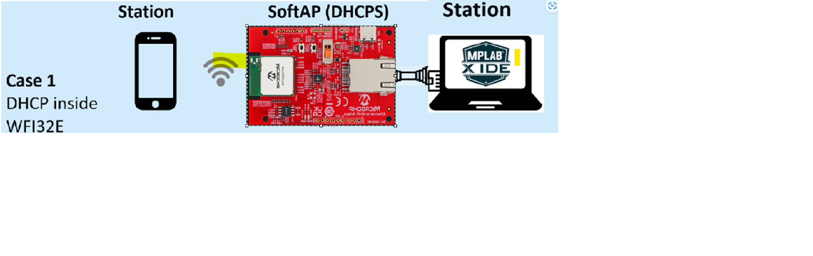
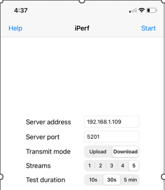
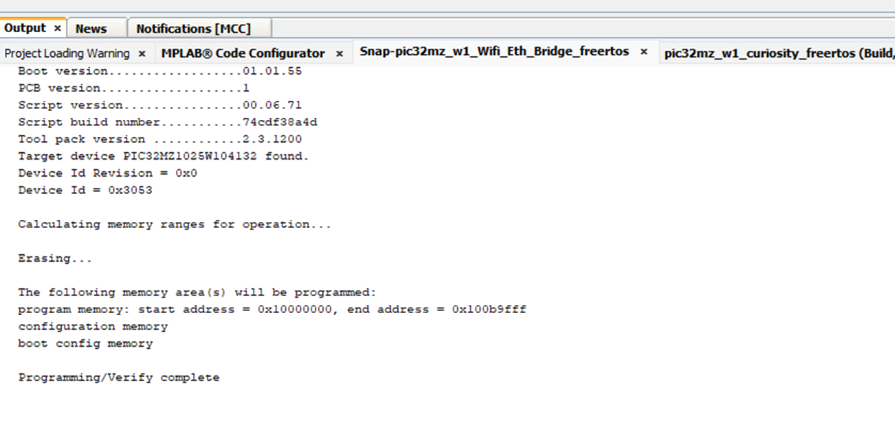

# Disclaimer

THE SOFTWARE ARE PROVIDED \"AS IS\" AND GIVE A PATH FOR SELF-SUPPORT
AND SELF-MAINTENANCE.\
This repository contains unsupported example code intended to help
accelerate client product development. It is not validated for
production nor audited for security best-practices.\
Note that while this repository is unsupported, Microchip welcome
community contributions, and all pull-requests will be considered for
inclusion into the repository.

Interact with peers in the community at [Wi-Fi
Forum](https://www.microchip.com/forums/f545.aspx).

# Introduction

The Ethernet to Wi-Fi Bridge Board is an affordable, compact, and
user-friendly development reference design that enables Ethernet
devices to connect via RJ45 cable and extend their network by linking
to a Wireless LAN. This bridge board features a command line interface
over UART, allowing users to configure operating modes such as
STA/SoftAP, adjust TCP/IP stack settings, and more.

Equipped with the WFI32E01PC module---a highly integrated Wi-Fi® MCU
module---the board supports advanced smart Wi-Fi functionalities and
premium MCU features. For more details about the Wi-Fi module/SoC,
visit:
[WFI32E01PE](https://www.microchip.com/en-us/product/wfi32e01pe).

The bridge board facilitates connections for devices that only have
Ethernet ports, such as older printers, PCs, industrial devices, or
IoT equipment, allowing them to join modern Wi-Fi networks without the
need to run Ethernet cables throughout the space. Devices connected
via Ethernet can easily access shared resources, cloud services, and
streaming capabilities, enhancing their functionality without direct
Wi-Fi capabilities.

# Overview

Network bridging is a function that creates a single, aggregate
network from more than two communication networks.

Routing and bridging are often misinterpreted as the same function.
Routing function allows more than two networks to communicate while
remaining as separate/independent networks. Whereas, bridging function
connects two separate networks as if they were a single network.

# Ethernet to Wi-Fi Bridge Features

## Hardware Features of Reference Bridge Board 

   * WFI32E01PE MCU with Inegrated WiFi
   * Microchip SST26VF032B 32 Mb External SPI Flash
   * On-board LAN8720A Ethernet-PHY with Integrated Magnetic RJ45 and LED
   * USB or External Powered at 3.3V Power Supply
   * Red Power LED
   * Two User LEDs
   * One Power Switch
   * One User Configurable Switch
   * One Reset Switch

## Bridge Application Features
   * Configure Soft-AP mode with Active DHCP Server in run time
   * Configure Soft-AP mode without Active DHCP Server in run time 
   * Configure STA-mode in run time
   * Firmware upgrade through UART
   * Command line interface

## Soft-AP mode with Active DHCP Server

By default, the bridge board is set to operate in SoftAP mode when it
boots up. In this configuration, the bridge serves as an Access Point
(AP), managing MAC packet routing at the MAC (Layer 2) level. This
allows it to act as a central hub, seamlessly enabling wireless
devices (clients) to connect to the network.

In addition to wireless connectivity, the bridge allows Ethernet
devices to connect via an RJ45 cable, establishing a local network
that supports direct communication between Ethernet-connected devices
and those connected wirelessly to the bridge. This dual connectivity
promotes efficient data exchange and collaboration across all devices,
enhancing overall network functionality.

With this setup, users can enjoy a streamlined networking experience
where resources can be shared easily, regardless of the connection
type. Whether accessing shared files, collaborating on projects, or
streaming data, the bridge facilitates smooth interactions,
significantly improving user experience and productivity

## Soft-AP mode without DHCP Server

The Bridge can be configured to obtain an IP address from an existing
Access Point (AP) by disabling the DHCP server on the bridge board.
This setup ensures that all client device---both wireless (WLAN) and
Ethernet connected devices received their IP address from the existing
AP's DHCP server.

By doing this, the bridge effectively integrates into the existing
network infrastructure, allowing for seamless communication among all
devices. This configuration simplifies network management, as it
eliminates the need for multiple DHCP servers and ensures consistent
IP address allocation for both WLAN and Ethernet devices. As a result,
user can enjoy a more cohesive network experience with improved
connectivity and resource sharing across network.

## STA mode

Users can switch from SoftAP mode to STA (Station) mode without the
need to rebuild the project. Once the bridge's operating is changes,
the Wi-Fi configuration settings are saved in non-volatile memory
(NVM), ensuring that these settings persist through reboots.

In STA mode, MAC packets are currently routed through the application layer, rather than at MAC level. In STA mode,
the bridge allows Ethernet devices to connect to an existing Access
Point (AP). This setup facilitates direct communication and resource
sharing with other devices on the network, significantly enhancing
collaboration and data access.

By transitioning to STA mode, users can integrate their Ethernet
devices into broader network ecosystem, leveraging existing Wi0Fi
infrastructure foe seamless connectivity. This flexibility not only
simplifies network management but also optimize resource utilization,
allowing devices to interact efficiently with both wired and wireless
counterparts.

## UART Boot Loader

The Preloaded binary on the bridge board includes functionality that
allows user to upgrade the firmware via UART (Universal Asynchronous
Receiver-Transmitter). This feature provides a straightforward and
efficient method for maintaining and enhancing the device's
performance.

By utilizing the UART interface, users can easily upload new firmware
version without the need for complex setups or additional tools. This
capability ensures that the bridge board can stay current with the
latest features, bug fixes, and security updates, allowing users to
optimize their devices functionality. Please refer the below section
to upgrade the firmware.

## Command Line Interface

Bridge board is equipped with a command line interface (CLI)accessible via UART,
CLI command/response enables users automate the Bridge operation programmatically,
also helps to troubleshoot issues, and adapt TCPIP settings on-the-fly, enhancing the
overall development and deployment experience. This flexibility is
especially beneficial for rapid prototyping and iterative testing, as
user can implement the changes immediately and observe their effects.

Below, you will find a list if supported commands that facilitate
these configurations, providing users with a powerful toolset for
optimizing their bridge boards performance.

### \>help: command describes supported commands groups and built in commands

###  \>bridge: The command \"bridge\" has a help in it. It supports statistics, status or FDB entries. These commands are very basic and simple.

### \> help DTMFGTest: (For Internal usage) shows usage of the command. This command is used for mass production testing

### \> help tcpip: Describes supported TCPIP commands and its usage

### \>wifiprovhelp: This command describes with examples about provisioning wifi device at run time.

# HW/SW requirements for OOB Demo

## Hardware Requirements
   * Ethernet to Wi-Fi Bridge Board (EV49N51A)
   * USB Type-C Cable for Power
   * USB-UART converter cable
   * RJ45 cable

## Software Requirements
   * Tera Term/Any serial terminal
   * Python (For Firmware upgrade)
# ping/iPerf Test
   * ping/iperf test to assess Eth-to-WiFi bridge functionality
   * Ping from WLAN client (STA-2) to Ethernet client or vise-versa (from Ethernet client to WLAN client)
   * Example - ping test from Ethernet client to WLAN client
      * \>ping \<wireless LAN client IP address\>

   * ping test from wireless client to Ethernet client

Install "ping" app in iPhone, open application from iPhone and enter
ping \<Ethernet client IP address\>

   * Ipref test
      * Download ipref3.10_64bit for windows PC
      * Install "iPerf" app in iPhone
      * Connect Ethernet client over RJ45 cable
      * Make sure Ethernet client gets IP address range starts from "192.168. \* . \* "
      * Open iPhone and connect WiFi to Bridge board/DUT as a wireless client
      * Open command prompt from PC ( which is Ethernet client in this example ) and run iPerf server

   * Open iPerf application from iPhone, enter server IP (Ethernet client
    is Server in this scenario) with proper port number as below pic and
    click "start"

   * Server start receiving/sending bytes as shown below

   * Refer Try out section in this link for more details
    <https://github.com/MicrochipTech/PIC32MZW1_Ethernet_WIFI_Bridge?tab=readme-ov-file>
	
# How to Run Bridge Application (OOB Demo)

## Hardware and Software setup/Precondition 
   * Connect USB-to-UART converter RX to DUT's TX pin and USB-to-UART TX to DUT's RX pin of J203 header.
   * Power up the board using USB Type-C cable.
   * Switch on the board using Power switch (SW201)
   * Connect DUT's Ethernet interface to Ethernet client which can be PC
   * Configure Tera Term/Any serial terminal with the below settings

## AP mode with Active DHCP Server

   * By default, Bridge board/DUT boot-up in SoftAP mode with the following settings
   * Connect Ethernet interface of Bridge board/DUT to PC using RJ45
    cable.
   * Restart DUT by switch-off and switch-n using Power switch (SW201)
   * Open command prompt from PC and enter "ipconfig" command after
    20-30s of Ethernet connection.
   * If you are seeing Ethernet adapter IPv4 address range start from "192.168. \* . \* ", skips the below 1-4 steps. If Ethernet address is from Autoconfiguration IPv4 address, follow the below steps to get the required IP range

      1 Enter command "ipconfig /release" and "ipconfig /renew"
      2 Remove the Ethernet cable, restart the DUT and connect back Ethernet cable to PC
      3 After \~30sec, enter "ipconfig" command from PC command prompt
      4 Repeat 1-4 above steps until you get IP address range start from "192.168. \* . \* ".

   * Connect one Client (STA-2) to Bridge/DUT wirelessly
   * Use Android/iPhone, enable WiFi and connect to "DEMO_Wi-Fi_ETH_BRIDGE"
   * After successful connection, perform Ping/iPerf Test ( Refer "ping/iPerf Test" section)

## AP mode without DHCP Server
   * Reboot the Bridge device and connect external AP with DHCP server enabled via RJ45 cable. (refer above picture shows )
   * Disable the DHCP server and Enable DHCP client from both Ethernet
    and WiFi interface.

\>netinfo

\>dhcps PIC32MZW1 off // disable dhcp server in WiFi interface

\>dhcp PIC32MZW1 on //enable dhcp client in WiFi interface

\>dhcps PIC32MZWINT off

\>dhcp PIC32MZWINT on

   * Use one more RJ45 cable to connect between external AP and Ethernet client ( PC in our setup, refer the above pic )
   * Open command prompt from PC and enter "ipconfig" to make sure IP is provided from external AP.
   * Connect one more wireless client (iPhone) to Bridge board/DUT.
   * Perfom ping/iPerf Test (Refer ping/iPerf Test section)   

## STA mode 
   * Enable mobile Hotspot and provide required credentials to connect bridge board/DUT as client device.
   * Reboot the device (Don't connect Ethernet cable to Bridge board/DUT)
   * (Switching AP to STA mode) Enter this command over Bridge CLI 
   \> wifiprov set 0 1 "GEN" 0 1 4 "DEMO_STA_Wi-Fi_ETH_BRIDGE" "password" and reboot the device

STA mode settings will be persistently saved to NVM, it will be erased
after reset.
   * Bridge board as client/STA connected to mobile Hotspot and gets the IP address from AP (mobile Hotspot)

   * Connect Ethernet interface of bridge board/DUT to PC via RJ45 cable
   * Make sure Ethernet client also gets the IP from AP (mobile Hotspot)
   * Connect to mobile Hotspot from 2nd phone over WiFi.
   * Perform ping/iPerf test from Wi-Fi end node device ( Refer ping/iPerf Test section)

# HW/SW Requirements for Building Custom Bridge Application

## Hardware Requirements
   * Ethernet to Wi-Fi Bridge Board (EV49N51A)
   * USB Type-C Cable for Power
   * USB-UART converter cable
   * RJ45 cable
   * Host PC
   * Programmer/Debugger – snap, ICD-4/5/PICkit-5 (Interface board if you are using snap/ICD )
   * Micro USB cable
   
## Software Requirements
   * MPLAB X IDE v6.20
   * XC32 v4.40 Compiler
   * PIC32MZ-W_DFP v1.8.326
   * MCC v5.50
   * Tera Term/Any serial terminal with 115200 baud-rate
   * Python v3.12 and above (For Firmware upgrade)
   * Harmony component ( https://bitbucket.microchip.com/projects/MH3 search component name)
      * Bootloader v3.8.0-rc.1 
      * CMSIS_5 v5.9.0 (https://github.com/ARM-software/CMSIS_5)
      * cmsis-freertos 10.3.1
      * core v3.13.2
      * crypto v3.8.1
      * csp v3.18.2
      * dev_packs v3.18.0-rc.1
      * mhc-core v3.8.4
      * net v3.11.0
      * wireless_system_pic32mzw1_wfi32e01 v3.8.0
      * wireless_wifi v3.10.0
      * wolfssl v5.4.0
   * git 2.46.0 and above (Optional)

# How to Build Custom Bridge Application
   * clone or download Bridge project from here https://github.com/MicrochipTech/WFI32_Ethernet_Wi-Fi_Bridge_OOB
   * Open project in MPLAB X IDE (WFI32_Ethernet_Wi-Fi_Bridge_OOB\firmware\pic32mz_w1_Wifi_Eth_Bridge_freertos.X)
   * Make sure your DFP and compiler are properly selected
   

   * Clink on MPLAB Code Configurator v5 to see or modify Harmony configuration

      * WIFI Provisioning Service stored in NVM

	  
      * SPI settings (High speed SPI Enabled)

      * WiFi service settings

      * Application Layer Overview

      * TCPIP settings

      * System Settings

      * Network Settings

      * MAC-0 Instance

      * MAC-1 Instance

	  
      * LAN8720A settings

	
      * FreeRTOS settings

      * System Settings

   * User can customize these MCC settings based on requirement and generate the code
   * Click “Generate” button to generate code

   * Merge carefully if needed or you can close “Merge[MCC]” window to ignore the changes
   * Connect Programmer/Debugger before you build the project (snap/ICD-4/5/PICkit-5), power on the board
      * If MPLAB is not detecting any of your debugger, restart MPLAB without disconnecting debugger from DUT and try again
   * Click Make and program Device Main Project in IDE

   * On successful programming

   * Perform Bridge operation as per the “How to Run the Bridge Application (OOB)”

# How to Upgrade Firmware over UART
   * Enter into boot loader mode by entering command ":\> btlmode" in DUT command prompt
   * Disconnect the terminal connection   

   
   * Open command prompt from host PC and navigate bootloader\tools\ directory and run python script
      * python btl_host.py -v -i COM3 -d pic32mzw -a 0x90000000 -f "<folder path>\firmware\pic32mz_w1_Wifi_Eth_Bridge_freertos.X\dist\pic32mz_w1_eth_wifi_freertos\production\pic32mz_w1_Wifi_Eth_Bridge_freertos.X.production.bin"

  
   * wait for Firmware upgrade and restart the DUT

# Reference
   * https://github.com/MicrochipTech/PIC32MZW1_Ethernet_WIFI_Bridge
   * https://github.com/MicrochipTech/PIC32MZW1_Ethernet_WIFI_Bridge_For_Ethernet_End_Node

# know Issue/Limitation
